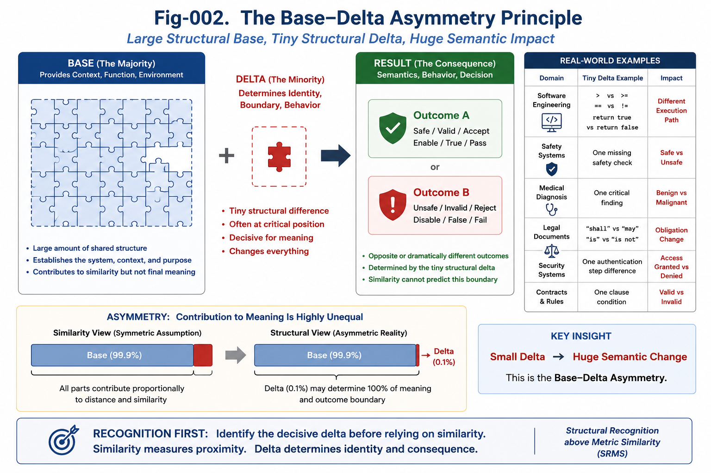
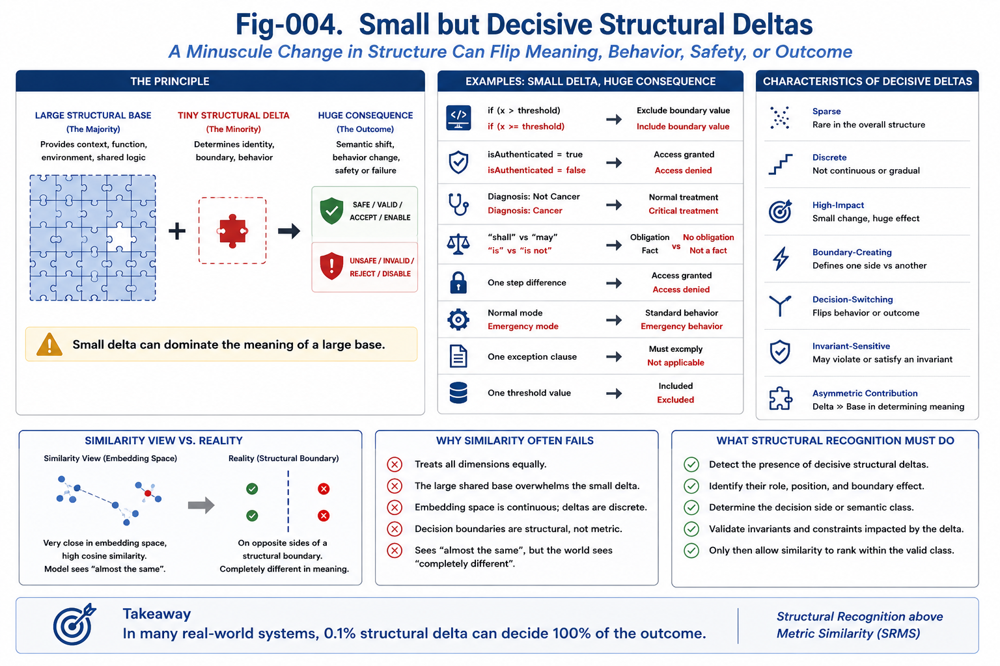
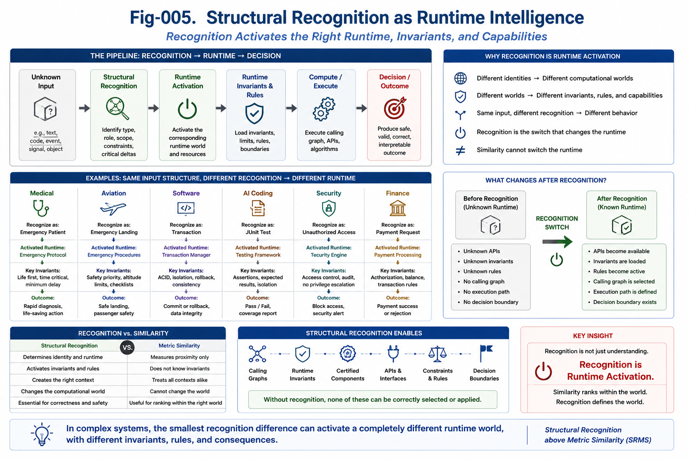

# Structural Recognition above Metric Similarity (SRMS)

> **Recognition First. Similarity Second.**

**Author:** Sizhe Tan and GPT-Obot

---

# Overview

Modern AI has achieved extraordinary success using metric similarity.

Embedding models, cosine similarity, vector databases, Retrieval-Augmented Generation (RAG), semantic search, recommendation systems, and Large Language Models all rely heavily on measuring similarity.

This paradigm has transformed information retrieval and language understanding.

However, many real-world engineering decisions are not determined by overall similarity.

They are determined by **small but decisive structural differences**.

Examples include:

* `SAFE` vs. `UNSAFE`
* `>` vs. `>=`
* `==` vs. `!=`
* `allow` vs. `deny`
* `authenticated` vs. `unauthenticated`
* `normal` vs. `emergency`

These differences occupy only a tiny fraction of the overall representation while completely changing runtime behavior, safety, legality, correctness, or engineering decisions.

This repository proposes a new computational principle:

> **Structural Recognition should precede Metric Similarity.**

Similarity remains one of the most valuable computational tools in AI.

The contribution of SRMS is not to replace similarity.

It is to place similarity inside a larger structural recognition architecture.

---


---

## Quick Navigation

- [Start Here](./docs/START-HERE.md)
- [Figure Index](./docs/FIGURE-INDEX.md)
- [Technical Papers](./docs/)
- [PDF Collection](./docs/pdf/)

---

# Central Principle

Traditional AI typically follows:

```text
Input
    ↓
Embedding
    ↓
Similarity
    ↓
Ranking
    ↓
Decision
```

SRMS proposes:

```text
Input
    ↓
Structural Recognition
    ↓
Critical Delta Detection
    ↓
Decision Boundary Recognition
    ↓
Runtime Activation
    ↓
Runtime Invariant Verification
    ↓
Structural Confidence
    ↓
Certified Structural Assets
    ↓
Similarity Ranking
    ↓
Decision
```

Recognition establishes the computational world.

Similarity optimizes inside that world.

---

# Why SRMS?

The central observation behind this repository is simple.

Similarity answers:

> **How close are two objects?**

Recognition answers:

> **What is this object?**

These are fundamentally different computational questions.

Future AI requires both.

Recognition determines structural identity.

Similarity ranks alternatives within recognized structures.

Reliable intelligence depends on performing these two computations in the correct order.

---

# Repository Structure

## SRMS-001 — Why Structural Recognition Must Stand above Metric Similarity

Introduces the central principle of the repository.

Explains why structural recognition should precede metric similarity.

- [SRMS-001—Why_Structural_Recognition_Must_Stand_above_Metric_Similarity.md](./docs/SRMS-001—Why_Structural_Recognition_Must_Stand_above_Metric_Similarity.md)

---


---

## SRMS-002 — The Base–Delta Asymmetry Principle

Shows why a tiny structural delta can dominate a massive shared structural base.

Introduces one of the core theoretical principles of SRMS.

- [SRMS-002—The_Base–Delta_Asymmetry_Principle.md](./docs/SRMS-002—The_Base–Delta_Asymmetry_Principle.md)

---



---

## SRMS-003 — Recognition-Gated Cosine Scoring

Presents the primary algorithmic contribution.

Cosine similarity is preserved but applied only after structural recognition has constructed a compatible candidate space.

- [SRMS-003—Recognition-Gated_Cosine_Scoring.md](./docs/SRMS-003—Recognition-Gated_Cosine_Scoring.md)

---


---

## SRMS-004 — Small but Decisive Structural Deltas

Analyzes the structural differences that actually determine engineering decisions.

Shows why decision boundaries are structural rather than metric.

- [SRMS-004—Small_but_Decisive_Structural_Deltas.md](./docs/SRMS-004—Small_but_Decisive_Structural_Deltas.md)

---



---

## SRMS-005 — Structural Recognition as Runtime Intelligence

Proposes that recognition is not merely classification.

Recognition activates the correct runtime, Calling Graph, Runtime Invariants, and computational world.

- [SRMS-005—Structural_Recognition_as_Runtime_Intelligence.md](./docs/SRMS-005—Structural_Recognition_as_Runtime_Intelligence.md)

---



---

## SRMS-006 — Structural Confidence Accumulation

Introduces structural confidence as accumulated engineering evidence rather than statistical probability.

Connects recognition to trustworthy decision making.

- [SRMS-006—Structural_Confidence_Accumulation.md](./docs/SRMS-006—Structural_Confidence_Accumulation.md)

---


---

## SRMS-007 — Certified Structural Components

Explains how successful recognition becomes reusable engineering infrastructure through certification.

Introduces Certified Structural Assets as long-term computational capital.

- [SRMS-007—Certified-Structural-Components.md](./docs/SRMS-007—Certified-Structural-Components.md)

---


---

## SRMS-008 — The Structural Recognition Pipeline for Future AI

Integrates the entire repository into one recognition-centered computational architecture for future AI.

- [SRMS-008—The_Structural_Recognition_Pipeline_for_Future AI.md](docs/SRMS-008—The_Structural_Recognition_Pipeline_for_Future AI.md)

---


---

# Figures

## Fig-000

SRMS Overview

Repository overview and paradigm shift.

---

## Fig-001

From Metric Similarity to Structural Recognition

---

## Fig-002

The Base–Delta Asymmetry Principle

---

## Fig-003

Recognition-Gated Cosine Scoring

---

## Fig-004

Small but Decisive Structural Deltas

---

## Fig-005

Structural Recognition as Runtime Intelligence

---

## Fig-006

Structural Confidence Accumulation

---

## Fig-007

Certified Structural Components and Structural Assets

---

## Fig-008

The Structural Recognition Pipeline for Future AI

---

# Reading Path

Recommended reading order:

```text
Fig-000
        ↓
SRMS-001
        ↓
Fig-001
        ↓
SRMS-002
        ↓
Fig-002
        ↓
SRMS-003
        ↓
Fig-003
        ↓
SRMS-004
        ↓
Fig-004
        ↓
SRMS-005
        ↓
Fig-005
        ↓
SRMS-006
        ↓
Fig-006
        ↓
SRMS-007
        ↓
Fig-007
        ↓
SRMS-008
        ↓
Fig-008
```

The repository is intentionally organized so that each paper builds directly upon the previous one.

---

# Relation to the Structural Intelligence Framework

SRMS naturally connects to several companion repositories.

| Repository | Primary Contribution              |
| ---------- | --------------------------------- |
| SFC        | Structural Feasibility Confidence |
| RI         | Runtime Invariants                |
| RIA        | Runtime Invariant Architecture    |
| SCR        | Structural Cognitive Runtime      |
| AAP        | AI Action Paths                   |
| IJS        | Information Job Shop              |

Within this broader framework:

* SRMS explains **how structures are recognized**.
* RI explains **what remains invariant**.
* SCR explains **how recognized structures execute**.
* SFC explains **how structural confidence grows**.
* RIA explains **how verified structures become reusable assets**.

Together they form a recognition-centered view of intelligent computation.

---

# Key Contributions

This repository introduces several closely connected ideas.

* Structural Recognition above Metric Similarity
* Recognition First, Similarity Second
* Base–Delta Asymmetry
* Recognition-Gated Cosine Scoring
* Small but Decisive Structural Deltas
* Recognition as Runtime Activation
* Structural Confidence Accumulation
* Certified Structural Assets
* Recognition-Centered AI Architecture

Together these concepts redefine the role of similarity within future AI systems.

---

# Core Message

Metric similarity has become one of the most successful tools in modern AI.

Its success should be preserved.

Its responsibility, however, should be carefully defined.

Recognition determines identity.

Recognition determines runtime.

Recognition determines structural boundaries.

Recognition determines confidence.

Recognition creates reusable engineering assets.

Similarity then performs what it does best:

ranking structurally compatible alternatives.

Future AI will increasingly evolve from **Similarity-Centered AI** toward **Recognition-Centered AI**.

---

# SRMS Principle

> **Recognition establishes the computational world. Similarity optimizes inside that world. Recognition determines identity. Similarity measures proximity. Reliable AI requires Recognition First and Similarity Second.**


---

## Author

Sizhe Tan\
Independent Researcher

GPT-Obot\
AI Research Assistant

2026

## Citation

DOI: 10.5281/zenodo.21348222

## License

Apache-2.0

---

## 📚 DBM-SI Series Navigation

See:\
[./docs/DBM-SI-Series-of-gitHub-Repositories/DBM-SI-Series-of-gitHub-Repositories.md](./docs/DBM-SI-Series-of-gitHub-Repositories/DBM-SI-Series-of-gitHub-Repositories.md)

[./docs/DBM-SI-Series-of-gitHub-Repositories/DBM-SI-Structural-Intelligence-Dictionary-(v2).md](./docs/DBM-SI-Series-of-gitHub-Repositories/DBM-SI-Structural-Intelligence-Dictionary-(v2).md)

