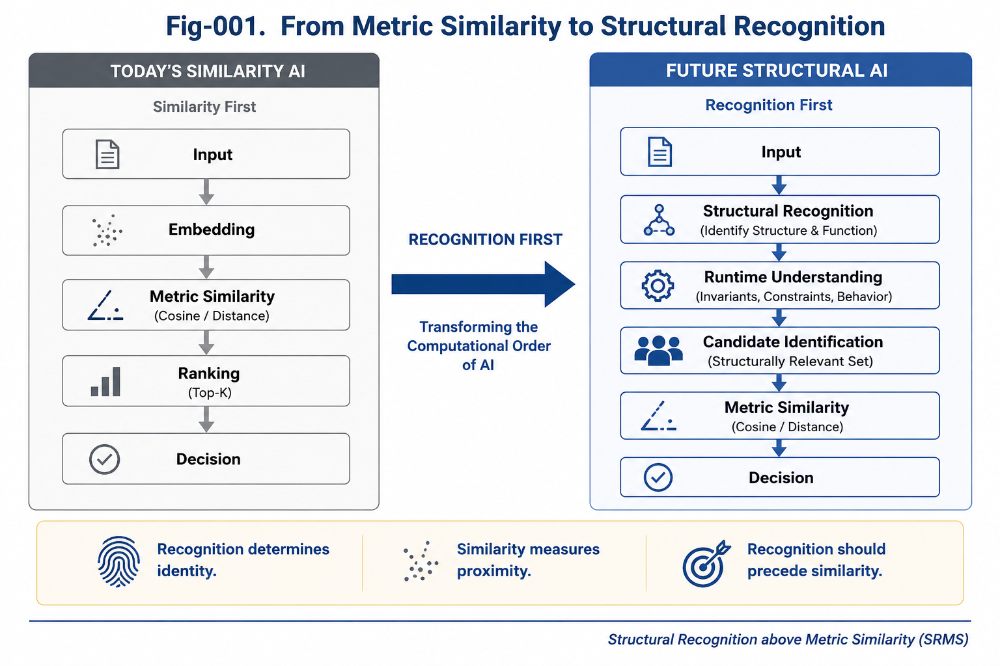

# SRMS-001 — Why Structural Recognition Must Stand above Metric Similarity

## Structural Recognition above Metric Similarity (SRMS)

**Author:** Sizhe Tan and GPT-Obot

---

## Abstract

Metric similarity has become one of the dominant paradigms in modern AI systems. Embedding spaces, cosine similarity, nearest-neighbor retrieval, and vector databases have enabled remarkable progress in semantic search, information retrieval, and large language models.

However, similarity alone cannot determine meaning.

Many real-world decisions depend not on overall similarity but on recognizing small structural differences that fundamentally change semantics, logic, safety, legality, or functionality.

This paper argues that **structural recognition must precede metric similarity**.

Rather than replacing similarity-based methods, we propose a new computational principle:

> **Recognition First. Similarity Second.**

This principle provides a foundation for future AI systems capable of reliable reasoning, engineering decision-making, and structural understanding.

---



---

# 1. The Success of Metric Similarity

Modern AI has demonstrated the enormous value of metric similarity.

Representative technologies include:

* Embedding models
* Cosine similarity
* Vector databases
* Retrieval-Augmented Generation (RAG)
* Semantic search
* Recommendation systems
* Approximate nearest-neighbor search

These methods all follow the same basic philosophy:

> Objects that are close in a metric space are likely to be semantically related.

For many applications, this assumption works remarkably well.

Metric similarity has therefore become one of the most successful computational tools in today's AI ecosystem.

---

# 2. Similarity Does Not Equal Recognition

Although similarity is powerful, it answers only one question:

> **How close are two objects?**

Real intelligence often requires answering a different question:

> **What is this object?**

These are fundamentally different computational problems.

Consider several examples:

* Two legal contracts may share more than 99% of their text while representing completely different legal obligations.
* Two software programs may differ by only one comparison operator but produce opposite behaviors.
* Two medical reports may contain one critical finding that changes the diagnosis entirely.
* Two aircraft control programs may differ by a single safety condition with life-critical consequences.

In all of these cases:

* Overall similarity remains extremely high.
* The final decision depends entirely on recognizing a small structural difference.

Recognition is therefore not merely a refinement of similarity.

Recognition is an independent computational capability.

---

# 3. Structural Recognition

Structural recognition identifies the organizational structures that determine meaning.

Rather than asking:

> **How similar are these objects?**

Structural recognition asks:

* What structure is present?
* What function does it perform?
* Which components are invariant?
* Which structural differences are decisive?
* Which runtime behaviors will emerge?

These questions cannot be answered by distance alone.

They require explicit structural understanding.

---

# 4. Recognition Before Similarity

Traditional AI pipelines often follow this pattern:

```text
Input
    ↓
Embedding
    ↓
Similarity
    ↓
Ranking
    ↓
Decision
```

We propose reversing this order.

Future AI systems should instead follow:

```text
Input
    ↓
Structural Recognition
    ↓
Candidate Identification
    ↓
Metric Similarity
    ↓
Ranking
    ↓
Decision
```

Similarity remains extremely valuable.

However, similarity should operate **within structurally recognized candidates**, rather than attempting to replace structural recognition itself.

---

# 5. Why Small Structural Differences Matter

Engineering is full of situations where tiny structural differences produce enormous consequences.

Examples include:

* SAFE vs UNSAFE
* ENABLE vs DISABLE
* ALLOW vs DENY
* PASS vs FAIL
* Cancer vs Non-Cancer
* Runtime Ready vs Runtime Failure

These examples illustrate an important observation:

> Small structural deltas often dominate large metric similarities.

Recognition must therefore identify these decisive structures before any similarity score is interpreted.

---

# 6. Similarity Is Continuous; Recognition Is Discrete

Metric similarity is typically continuous.

Similarity values change gradually.

Recognition, however, is often discrete.

Examples include:

* authenticated / unauthenticated
* compiled / not compiled
* certified / uncertified
* executable / non-executable
* legal / illegal
* safe / unsafe

A tiny structural change may move an object across one of these boundaries.

This transition cannot be reliably inferred from similarity alone.

Recognition detects structural boundaries.

Similarity measures variation within those boundaries.

The two operations complement each other but are not interchangeable.

---

# 7. Recognition as the First Layer of Intelligence

Recognition is not merely another algorithm.

It is the entry point of intelligent computation.

Recognition determines:

* what an object is,
* which runtime it belongs to,
* which rules apply,
* which invariants exist,
* which actions become possible.

Only after these structural questions are answered does similarity become meaningful.

Without recognition, similarity lacks structural context.

---

# 8. Structural Recognition Above Metric Similarity

We therefore propose the central principle of this repository:

> **Structural Recognition should stand above Metric Similarity.**

Similarity remains one of the most valuable computational tools developed by modern AI.

However, similarity should support structural recognition rather than replace it.

Recognition determines identity.

Similarity measures proximity.

Identity should always precede proximity.

---

# 9. Implications for Future AI

This principle naturally extends to many research directions, including:

* Runtime Invariant Recognition
* Structural Calling Graphs
* Differential Trees
* Structural Feasibility Confidence (SFC)
* Certified Runtime Components
* Recognition-Gated Similarity Search
* AI Runtime Architectures
* Reliable Engineering AI
* Scientific Discovery
* Long-Horizon Reasoning

Together, these directions suggest a future AI architecture in which structural understanding forms the primary computational layer, while metric similarity becomes one component within a broader recognition framework.

---

# Key Takeaways

* Similarity measures proximity but does not determine identity.
* Recognition identifies structures that define meaning.
* Small structural differences can dominate large metric similarities.
* Recognition and similarity solve fundamentally different computational problems.
* Future AI should perform structural recognition before metric ranking.
* **Recognition First. Similarity Second.** provides a new computational principle for reliable AI systems.

---

# SRMS Principle 001

> **Recognition determines what an object is. Similarity measures how close comparable objects are. Intelligence requires Recognition before Similarity.**
