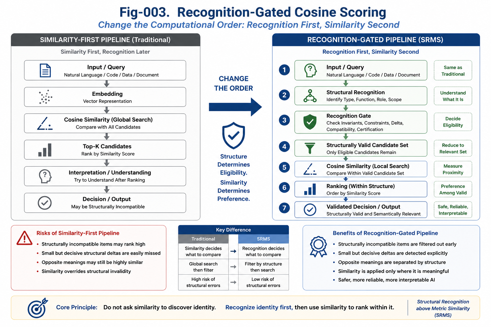

# SRMS-003 — Recognition-Gated Cosine Scoring

## Structural Recognition above Metric Similarity (SRMS)

**Author:** Sizhe Tan and GPT-Obot

---

## Abstract

Cosine similarity is one of the most useful and widely deployed scoring mechanisms in modern AI.

It supports semantic retrieval, embedding search, recommendation, clustering, Retrieval-Augmented Generation, and many other large-scale systems.

The central problem is therefore not that cosine scoring is inherently weak.

The problem is that cosine similarity is frequently asked to perform a task it was not designed to perform:

> determine structural identity before the relevant structure has been recognized.

This paper introduces **Recognition-Gated Cosine Scoring**, an architecture in which structural recognition precedes cosine ranking.

The recognition layer identifies structural identity, constraints, invariants, decisive deltas, and applicable runtime conditions. It then constructs a structurally valid candidate set. Cosine similarity operates only inside this recognized candidate space.

The resulting computational order is:

```text
Structural Recognition
    ↓
Recognition Gate
    ↓
Structurally Valid Candidate Set
    ↓
Cosine Scoring
    ↓
Ranking
    ↓
Decision
```

This architecture preserves the scalability and flexibility of cosine similarity while preventing metric proximity from overriding structural incompatibility.

---



---

# 1. Cosine Similarity Is Not the Enemy

Cosine similarity has become foundational infrastructure for modern AI.

It is effective because it can compare high-dimensional representations efficiently and at scale.

Typical applications include:

* semantic search,
* document retrieval,
* vector databases,
* recommendation systems,
* nearest-neighbor search,
* clustering,
* example selection,
* Retrieval-Augmented Generation,
* prompt routing,
* memory retrieval,
* multimodal matching.

These systems benefit from a simple and powerful assumption:

> Objects with similar vector directions are likely to contain related semantic information.

For broad retrieval and statistical association, this assumption is highly productive.

SRMS does not propose abandoning cosine similarity.

Instead, SRMS asks a more precise architectural question:

> At which stage of computation should cosine similarity be trusted?

---

# 2. The Problem Is Computational Order

Many current systems follow a similarity-first pipeline:

```text
Input
    ↓
Embedding
    ↓
Cosine Similarity
    ↓
Top-K Candidates
    ↓
Interpretation
    ↓
Decision
```

In this architecture, cosine similarity performs the first major reduction of the search space.

The system assumes that the nearest candidates are also the structurally relevant candidates.

This assumption is often acceptable for exploratory retrieval.

It is much less reliable when small structural deltas determine:

* safety,
* legality,
* executability,
* compatibility,
* authorization,
* diagnosis,
* control flow,
* runtime behavior,
* engineering validity.

The error is not necessarily inside the cosine computation.

The error occurs before cosine scoring begins.

The candidate population has not yet been structurally qualified.

---

# 3. Metric Proximity Does Not Guarantee Structural Compatibility

Two objects can be extremely close in an embedding space while belonging to different structural classes.

Examples include:

```text
allow access
deny access
```

```text
temperature > threshold
temperature <= threshold
```

```text
component is certified
component is not certified
```

```text
payment is refundable
payment is non-refundable
```

```text
execute under normal mode
execute under emergency mode
```

These pairs share most of their vocabulary and context.

Their cosine similarity may therefore remain high.

Yet their structural roles and consequences may be opposite.

A similarity-first system may retrieve both as near neighbors without recognizing that they belong on different sides of a decision boundary.

This produces a fundamental distinction:

> Metric closeness describes representational proximity. Structural compatibility determines whether two objects should be compared, combined, substituted, or ranked together.

---

# 4. Recognition-Gated Cosine Scoring

Recognition-Gated Cosine Scoring changes the computational order.

Instead of allowing cosine similarity to define the candidate set, structural recognition first determines which candidates are eligible for metric comparison.

The proposed pipeline is:

```text
Input
    ↓
Structural Recognition
    ↓
Recognition Gate
    ↓
Structurally Valid Candidate Set
    ↓
Embedding or Metric Projection
    ↓
Cosine Scoring
    ↓
Ranking
    ↓
Decision
```

The recognition gate does not replace cosine similarity.

It protects cosine similarity from being applied across structurally incompatible objects.

---

# 5. What the Recognition Gate Recognizes

A Recognition Gate may examine several classes of structural evidence.

## 5.1 Structural Type

The gate determines what kind of object is being processed.

Examples include:

* command,
* condition,
* constraint,
* contract clause,
* software component,
* runtime state,
* medical finding,
* safety rule,
* executable plan,
* descriptive text.

Objects of different structural types may be semantically related but operationally non-substitutable.

---

## 5.2 Functional Role

The gate identifies the role played by an object inside a larger structure.

Examples include:

* precondition,
* trigger,
* action,
* exception,
* termination rule,
* authorization check,
* recovery path,
* validation step,
* output condition.

Two objects may use similar language while performing different functions.

Functional recognition prevents them from being ranked as interchangeable alternatives.

---

## 5.3 Runtime Invariants

The gate identifies conditions that must remain preserved across representations or implementations.

Examples include:

* required input conditions,
* state-transition constraints,
* safety invariants,
* authorization boundaries,
* dependency requirements,
* output guarantees.

A candidate that violates a required invariant should not survive merely because its embedding is close to the query.

---

## 5.4 Critical Structural Deltas

The gate detects small differences with disproportionate semantic or runtime impact.

Examples include:

* negation,
* comparison operators,
* exception clauses,
* boundary values,
* mandatory versus optional conditions,
* normal versus emergency modes,
* inclusion versus exclusion,
* enabled versus disabled states.

These deltas are central to the Base–Delta Asymmetry Principle introduced in SRMS-002.

---

## 5.5 Scope and Context

The gate identifies the scope within which a statement or component is valid.

Examples include:

* local versus global scope,
* test versus production environment,
* normal versus emergency runtime,
* authenticated versus public context,
* one subsystem versus another subsystem,
* historical versus current state.

Similarity without scope recognition can retrieve information that is semantically related but structurally inapplicable.

---

## 5.6 Constraints and Certification Status

The gate may verify whether a candidate satisfies required constraints.

Examples include:

* certified versus uncertified,
* compatible versus incompatible,
* complete versus incomplete,
* valid versus invalid,
* approved versus unapproved,
* executable versus descriptive.

This is especially important in engineering systems where a highly similar but uncertified component cannot safely replace a certified one.

---

# 6. Hard Gates and Soft Gates

Recognition Gates can operate in more than one mode.

## 6.1 Hard Recognition Gate

A hard gate removes structurally invalid candidates before cosine scoring.

```text
Candidate
    ↓
Required Structure Present?
    ├── No  → Reject
    └── Yes → Send to Cosine Scoring
```

Hard gates are appropriate when structural violations are unacceptable.

Typical applications include:

* safety systems,
* access control,
* certified software reuse,
* medical decision support,
* legal compliance,
* runtime compatibility,
* executable code selection.

A hard structural failure should not be compensated for by a high similarity score.

---

## 6.2 Soft Recognition Gate

A soft gate does not necessarily remove candidates.

Instead, it classifies candidates into structural zones or adjusts their eligibility.

```text
Candidate
    ↓
Structural Recognition
    ├── Confirmed Zone
    ├── Extension Zone
    └── Speculative Zone
```

Cosine scoring may then operate separately inside each zone.

This mode is useful for:

* research exploration,
* analogy discovery,
* weakly structured domains,
* early-stage hypothesis generation,
* open-ended semantic search.

The system preserves exploratory breadth without confusing speculative similarity with confirmed structural compatibility.

---

## 6.3 Hybrid Gate

A hybrid gate combines both approaches.

It may reject candidates that violate non-negotiable constraints while assigning confidence levels to the remaining candidates.

```text
Candidate
    ↓
Mandatory Constraint Check
    ├── Failed → Reject
    └── Passed
           ↓
Structural Confidence Classification
           ├── Confirmed
           ├── Probable
           └── Exploratory
```

This architecture is particularly suitable for AI engineering systems because it distinguishes:

* impossible,
* unsafe,
* uncertain,
* feasible,
* certified.

---

# 7. Recognition-Gated Candidate Construction

The output of the recognition layer is not yet the final answer.

It is a structurally organized candidate space.

A candidate may be included because it shares one or more recognized properties with the query:

* the same structural type,
* the same functional role,
* compatible runtime invariants,
* the same decision-side classification,
* valid scope,
* compatible constraints,
* relevant structural ancestry,
* acceptable certification status.

The candidate set can therefore be represented conceptually as:

```text
All Available Objects
    ↓
Type-Compatible Objects
    ↓
Function-Compatible Objects
    ↓
Invariant-Compatible Objects
    ↓
Constraint-Compatible Objects
    ↓
Structurally Valid Candidate Set
```

Only after this reduction does cosine similarity rank the surviving candidates.

---

# 8. Cosine Scoring Inside a Recognized Structural Zone

Once a structurally valid candidate set has been created, cosine similarity becomes much more meaningful.

It can now answer a narrower and better-defined question:

> Among structurally compatible candidates, which one is most semantically or contextually similar to the input?

This is a proper role for cosine scoring.

The architecture separates two questions:

## Structural Recognition

```text
Which candidates are valid members of the comparison space?
```

## Cosine Scoring

```text
Which valid candidate is closest to the query?
```

This separation is the central algorithmic insight of Recognition-Gated Cosine Scoring.

---

# 9. Recognition Before Ranking

A conventional ranking system may produce:

```text
Candidate A — Cosine Score: 0.97
Candidate B — Cosine Score: 0.95
Candidate C — Cosine Score: 0.92
```

However, these scores do not indicate whether the candidates satisfy the required structure.

After structural recognition, the same set may become:

```text
Candidate A — Structurally Invalid
Candidate B — Structurally Valid
Candidate C — Structurally Valid
```

Cosine ranking should therefore be applied only to B and C:

```text
Candidate B — Cosine Score: 0.95
Candidate C — Cosine Score: 0.92
```

Candidate A must not win merely because it has the highest metric score.

This gives a strict priority rule:

```text
Structural Validity
    >
Metric Similarity
```

A structurally invalid candidate with a high cosine score should rank below a structurally valid candidate with a lower cosine score.

---

# 10. Recognition-Gated Scoring Model

The architecture can be expressed without requiring a single fixed implementation.

Each candidate passes through two major evaluation stages.

## Stage 1 — Structural Eligibility

```text
recognitionStatus(candidate, query)
```

Possible outputs include:

```text
REJECTED
SPECULATIVE
COMPATIBLE
CONFIRMED
CERTIFIED
```

## Stage 2 — Metric Scoring

Cosine scoring is applied only when the recognition status permits comparison.

```text
if recognitionStatus is permitted:
    calculate cosine similarity
else:
    exclude candidate
```

A ranked result can therefore carry both structural and metric information:

```text
Candidate
Structural Status
Recognized Type
Critical Delta Status
Invariant Compatibility
Cosine Score
Final Rank
```

This prevents a single scalar similarity value from hiding structural uncertainty.

---

# 11. Recognition Gates Need Not Be Monolithic

Structural recognition does not require one universal classifier.

A gate may be assembled from multiple specialized recognizers.

For example:

```text
Input
    ↓
Type Recognizer
    ↓
Scope Recognizer
    ↓
Invariant Checker
    ↓
Delta Detector
    ↓
Constraint Validator
    ↓
Recognition Gate
```

Each recognizer may use a different computational mechanism:

* rules,
* Calling Graphs,
* Differential Trees,
* Runtime Invariants,
* constraint engines,
* symbolic checks,
* classifiers,
* LLM-based structural probes,
* certified component registries,
* human review.

Recognition-Gated Cosine Scoring is therefore an architectural pattern rather than a dependency on one specific recognition algorithm.

---

# 12. Multi-Gate Recognition

Complex systems may require more than one gate.

A multi-gate pipeline may look like this:

```text
Input
    ↓
Domain Gate
    ↓
Structural-Type Gate
    ↓
Runtime-Invariant Gate
    ↓
Safety Gate
    ↓
Certification Gate
    ↓
Cosine Ranking
```

Each gate reduces the possibility of comparing incompatible objects.

This design is especially useful when different structural failures have different consequences.

For example:

* a domain mismatch may make a candidate irrelevant,
* an invariant mismatch may make it non-executable,
* a safety mismatch may make it unacceptable,
* a certification mismatch may make it unusable in production.

A single cosine score cannot express these distinctions.

---

# 13. Relation to Two-Phase Search

Recognition-Gated Cosine Scoring can be viewed as a new form of multi-phase search.

A simple two-phase retrieval pipeline often performs:

```text
Phase 1 — Broad Candidate Retrieval
Phase 2 — Metric Re-Ranking
```

Recognition-Gated Cosine Scoring adds a structural phase:

```text
Phase 1 — Broad Retrieval
Phase 2 — Structural Recognition and Gating
Phase 3 — Cosine Re-Ranking
```

For higher-assurance systems, the order may begin with structure:

```text
Phase 1 — Structural Recognition
Phase 2 — Structurally Constrained Retrieval
Phase 3 — Cosine Re-Ranking
Phase 4 — Decision Validation
```

This makes retrieval not merely similarity-driven but structurally governed.

---

# 14. Relation to Differential Trees

Differential Trees can support the recognition gate by identifying:

* shared bases,
* decisive deltas,
* structural branches,
* boundary-defining attributes,
* direct-to-leaf recognition paths.

A Differential Tree can distinguish objects that share a large common base but diverge at a small critical branch.

The recognition result can then determine which branch-specific candidates are eligible for cosine scoring.

This provides a natural integration:

```text
Differential Tree Recognition
    ↓
Structural Branch Selection
    ↓
Branch-Compatible Candidate Set
    ↓
Cosine Ranking
```

Cosine scoring remains useful, but it no longer crosses structural branches blindly.

---

# 15. Relation to Calling Graphs

Calling Graphs represent functional relationships, dependencies, and execution pathways.

They can help the recognition gate determine:

* where an object belongs,
* what it calls,
* what calls it,
* what prerequisites it requires,
* what downstream behavior it activates,
* whether it fits the current task path.

A candidate may be semantically similar to a requested component while occupying the wrong location in the Calling Graph.

Recognition-Gated Cosine Scoring can therefore use graph position and functional role as gating conditions before metric ranking.

---

# 16. Relation to Runtime Invariants

Runtime Invariants provide another basis for structural recognition.

Two implementations may look different and have moderate cosine similarity while preserving the same Runtime Invariant.

Conversely, two implementations may look highly similar while violating different invariants.

The gate should therefore ask:

* Does the candidate preserve the required state transition?
* Does it maintain the same constraints?
* Does it produce the required outcome?
* Does it preserve the safety boundary?
* Does it belong to the same runtime identity?

This leads to an important priority:

```text
Runtime-Invariant Compatibility
    >
Surface Similarity
```

Similarity should rank candidates only after invariant compatibility has been established.

---

# 17. Relation to Structural Feasibility Confidence

Recognition is not always certain.

A candidate may be:

* structurally confirmed,
* strongly supported,
* weakly supported,
* incomplete,
* speculative,
* rejected.

Structural Feasibility Confidence can therefore accompany the recognition gate.

A result may include:

```text
Recognition Status: Compatible
Structural Confidence: High
Invariant Coverage: Complete
Critical Delta Check: Passed
Cosine Score: 0.91
```

This is more informative than reporting:

```text
Cosine Score: 0.96
```

without knowing whether the candidate is structurally applicable.

Recognition-Gated Cosine Scoring thus supports confidence-aware retrieval and decision-making.

---

# 18. Relation to Certified Runtime Components

In Runtime Invariant Architecture, certified components can serve as recognized building blocks.

A Recognition Gate may restrict the candidate space to components that satisfy:

* required interfaces,
* required Runtime Invariants,
* compatibility conditions,
* provenance requirements,
* certification levels,
* deployment constraints.

Cosine similarity can then rank these certified candidates according to task relevance.

This creates a practical engineering workflow:

```text
Task Requirement
    ↓
Structural Recognition
    ↓
Certified Component Gate
    ↓
Compatible Certified Components
    ↓
Cosine Ranking
    ↓
Component Selection
```

This is substantially safer than ranking all available components by textual or embedding similarity alone.

---

# 19. Recognition-Gated RAG

Retrieval-Augmented Generation is a major application of this architecture.

A conventional RAG pipeline often uses:

```text
Query
    ↓
Embedding
    ↓
Vector Search
    ↓
Top-K Chunks
    ↓
LLM Generation
```

A Recognition-Gated RAG pipeline uses:

```text
Query
    ↓
Intent and Structural Recognition
    ↓
Scope, Constraint, and Delta Detection
    ↓
Recognition Gate
    ↓
Structurally Relevant Corpus or Partition
    ↓
Cosine Retrieval
    ↓
Evidence Validation
    ↓
LLM Generation
```

This can reduce retrieval errors caused by:

* obsolete policies,
* wrong product versions,
* opposite legal clauses,
* mismatched runtime modes,
* irrelevant technical domains,
* unsafe procedures,
* unverified documents.

The objective is not merely retrieving semantically similar text.

The objective is retrieving structurally applicable evidence.

---

# 20. Recognition-Gated Code Retrieval

Code search illustrates the importance of this architecture.

A query may request:

```text
A Java 8 non-recursive implementation with JUnit 4 compatibility
```

A similarity-first system may retrieve:

* recursive implementations,
* Java 17 syntax,
* JUnit 5 tests,
* conceptually similar pseudocode,
* incomplete fragments.

A Recognition Gate can first enforce:

```text
Language: Java
Version: Java 8
Recursion: Not Permitted
Testing Framework: JUnit 4
Completeness: Compilable Component
```

Cosine scoring can then rank only the candidates that satisfy these structural constraints.

The result is both relevant and implementable.

---

# 21. Recognition-Gated Safety Decisions

In safety-critical systems, metric scores must never override structural prohibitions.

A candidate may be highly similar to a valid control policy but differ in one critical condition.

The gate should test:

* required safety checks,
* emergency-state handling,
* boundary conditions,
* fail-safe behavior,
* forbidden actions,
* certification status.

The governing rule is:

> A safety-critical structural failure cannot be repaired by a higher similarity score.

This is one of the clearest applications of the SRMS hierarchy.

---

# 22. Recognition-Gated Scientific Search

Scientific discovery also benefits from separating structural recognition from similarity.

Two papers may discuss the same vocabulary but address:

* different causal structures,
* different experimental conditions,
* different scales,
* different populations,
* different mechanisms,
* opposite hypotheses.

Recognition can first classify these structural dimensions.

Cosine similarity can then rank papers inside the appropriate scientific comparison class.

This reduces the risk of treating surface-level semantic similarity as mechanistic equivalence.

---

# 23. Failure Modes

Recognition-Gated Cosine Scoring introduces its own engineering challenges.

## 23.1 False Rejection

A recognition gate may incorrectly exclude a useful candidate.

This can reduce recall and suppress unexpected discoveries.

Soft gates and speculative zones can help preserve exploratory candidates.

---

## 23.2 False Acceptance

A gate may fail to detect a decisive structural difference.

A highly similar but incompatible candidate may then enter the ranking stage.

Critical-delta detectors and invariant checks are essential for reducing this risk.

---

## 23.3 Incomplete Structural Models

The system may not yet know all relevant structures.

The gate must therefore expose uncertainty rather than claiming complete recognition.

Unknown structural regions should be labeled explicitly.

---

## 23.4 Overly Rigid Recognition

A gate that is too strict may block analogy, transfer, and innovation.

Recognition architectures should distinguish production assurance from research exploration.

---

## 23.5 Gate Ordering Errors

In multi-gate systems, the order of recognition checks may affect efficiency and behavior.

Cheap, high-rejection gates may run early.

Expensive or specialized checks may run later.

The Calling Graph of the recognition process should itself be explicit and testable.

---

# 24. Recognition Is Also a Search-Space Engineering Tool

Recognition-Gated Cosine Scoring improves more than correctness.

It can also improve computational efficiency.

By reducing the search space before metric comparison, the system may avoid scoring large numbers of irrelevant candidates.

The architecture becomes:

```text
Large Unstructured Candidate Space
    ↓
Structural Recognition
    ↓
Small Valid Candidate Space
    ↓
Metric Ranking
```

Recognition therefore performs both:

* semantic protection,
* search-space reduction.

This is particularly valuable in large repositories, distributed AI runtimes, and certified component ecosystems.

---

# 25. Recognition-Gated Scoring as a General Pattern

Although this paper focuses on cosine similarity, the same architecture applies to other metric and statistical scoring methods.

Examples include:

* Euclidean distance,
* dot-product scoring,
* learned ranking models,
* probabilistic similarity,
* nearest-neighbor search,
* recommendation scores,
* graph similarity,
* sequence similarity,
* image similarity.

The general pattern is:

```text
Recognize First
    ↓
Gate the Comparison Space
    ↓
Score Second
```

Recognition-Gated Cosine Scoring is therefore one instance of a broader principle:

> Structural eligibility should be determined before metric preference.

---

# 26. From Similarity Trees to Recognition-Gated Scoring Trees

Many retrieval systems use hierarchical similarity scoring.

At each level, candidates are routed toward the most similar branch.

This can become fragile when a small decisive delta is weak relative to the shared base.

A Recognition-Gated Scoring Tree adds structural checks before or during branch selection.

```text
Node
    ↓
Structural Gate
    ├── Incompatible Branch → Exclude
    └── Compatible Branch
              ↓
         Cosine Scoring
              ↓
         Select Next Node
```

This prevents a large shared base from repeatedly overpowering a small but decisive delta.

It also provides a direct response to the central concern of this repository:

> Similarity trees should not be trusted to discover all structural boundaries by score alone.

---

# 27. Minimal Algorithmic Blueprint

A minimal implementation can follow this sequence:

```text
1. Receive the query or input object.

2. Recognize its structural type, function, scope, constraints,
   invariants, and critical deltas.

3. Retrieve or construct candidate objects.

4. Apply structural gates to each candidate.

5. Reject structurally incompatible candidates.

6. Assign confidence or recognition zones to uncertain candidates.

7. Compute cosine similarity only for permitted candidates.

8. Rank candidates inside compatible structural classes.

9. Validate the top candidate against mandatory constraints.

10. Return both the recognition evidence and the metric score.
```

The final result should explain both:

```text
Why this candidate is structurally valid.
```

and:

```text
Why this candidate is metrically preferred.
```

---

# 28. Recommended Result Record

A Recognition-Gated Cosine Scoring system should avoid returning only a scalar score.

A more complete result record may include:

```text
Candidate ID
Recognized Structural Type
Functional Role
Scope
Runtime-Invariant Compatibility
Critical Delta Findings
Constraint Status
Certification Status
Structural Confidence
Cosine Score
Final Rank
Decision Explanation
```

This record preserves the reasoning path from recognition to ranking.

It also supports:

* auditing,
* debugging,
* certification,
* human review,
* runtime updates,
* model comparison.

---

# 29. Recognition First Does Not Mean Similarity Last in Every Detail

The phrase **Recognition First, Similarity Second** describes the governing hierarchy.

It does not require that no metric operation occur during recognition.

Recognition algorithms may themselves use:

* embeddings,
* local similarity,
* learned classifiers,
* retrieval,
* statistical evidence.

The key requirement is architectural:

> Metric similarity must not have final authority over structural identity or structural validity.

Similarity may assist recognition.

It must not silently replace recognition.

---

# 30. A New Division of Computational Labor

Recognition-Gated Cosine Scoring establishes a clear division of labor.

## Structural Recognition Determines

* identity,
* eligibility,
* compatibility,
* constraints,
* invariant preservation,
* decision-side membership,
* certification class.

## Cosine Scoring Determines

* proximity,
* contextual relevance,
* preference among valid candidates,
* ranking inside a recognized class.

This division allows both mechanisms to operate where they are strongest.

---

# 31. Implications for Future AI Architecture

Future AI systems should not be designed as one undifferentiated scoring engine.

They should include explicit layers for:

* structural recognition,
* critical-delta detection,
* Runtime Invariant checking,
* constraint validation,
* structural confidence,
* metric ranking,
* final decision validation.

The resulting architecture is more modular, inspectable, and certifiable.

It also supports the gradual evolution from similarity-centered AI toward structural runtime intelligence.

---

# 32. Conclusion

Cosine similarity remains one of the most useful scoring mechanisms in modern AI.

Its weakness appears when it is required to determine structural identity from metric proximity alone.

Recognition-Gated Cosine Scoring resolves this problem by changing the computational order.

Structural recognition first determines:

* what the input is,
* which candidates are structurally compatible,
* which deltas are decisive,
* which invariants must be preserved,
* which constraints must be satisfied.

Cosine similarity then ranks candidates inside the recognized structural space.

The result is not the rejection of similarity.

It is the disciplined placement of similarity inside a stronger architecture.

```text
Recognition
    ↓
Gate
    ↓
Cosine
    ↓
Decision
```

This is the central algorithmic transition from metric-first retrieval to structural intelligence.

---

# Key Takeaways

* Cosine similarity is valuable but should not determine structural identity by itself.
* The main weakness of similarity-first systems is the computational order, not the cosine calculation.
* Structural recognition should construct or validate the candidate space before metric ranking.
* Hard gates reject structurally invalid candidates.
* Soft gates preserve uncertainty and exploratory possibilities.
* Hybrid gates combine mandatory constraints with confidence zones.
* Runtime Invariants, Calling Graphs, Differential Trees, and certified components can all support recognition gates.
* Cosine scoring should rank candidates only inside structurally compatible classes.
* A structurally invalid candidate must not win because of a high similarity score.
* Recognition-Gated Cosine Scoring preserves the advantages of metric AI while adding structural reliability.

---

# SRMS Principle 003

> **Cosine similarity should rank candidates only after structural recognition has determined that those candidates belong in the same valid comparison space. Structural eligibility precedes metric preference.**

---

# Recognition-Gated Cosine Scoring Rule

```text
Recognition First
    ↓
Structural Gate
    ↓
Compatible Candidate Space
    ↓
Cosine Scoring
    ↓
Ranking
    ↓
Validated Decision
```

> **Do not ask similarity to discover identity. Recognize identity first, then use similarity to rank within it.**
