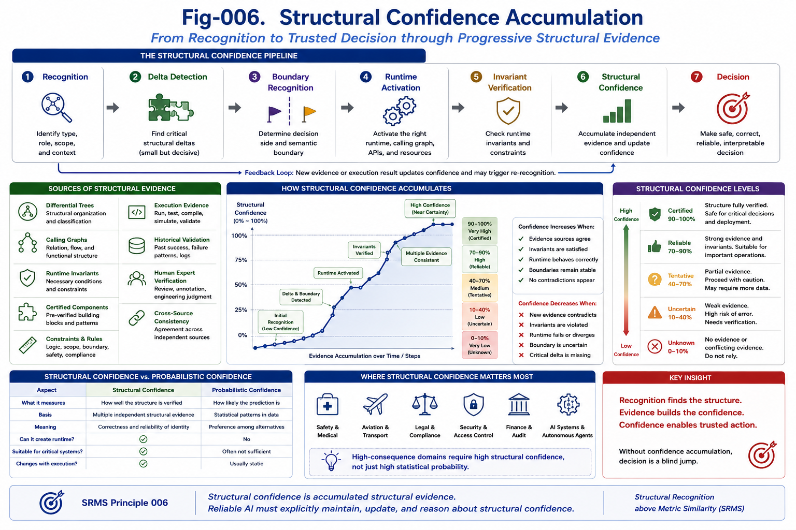

# SRMS-006 — Structural Confidence Accumulation

## Structural Recognition above Metric Similarity (SRMS)

**Author:** Sizhe Tan and GPT-Obot

---

# Abstract

Recognition is rarely completed in a single computational step.

Instead, structural recognition is usually a progressive process in which evidence accumulates, structural hypotheses become increasingly constrained, Runtime Invariants are verified, and confidence gradually converges toward a stable structural interpretation.

This paper introduces the concept of **Structural Confidence Accumulation**.

Unlike statistical confidence, structural confidence measures how completely and consistently a structure has been recognized.

Recognition therefore evolves from uncertainty to structural certainty through successive evidence accumulation.

This process forms one of the fundamental mechanisms of reliable AI.

---



---

# 1. Recognition Is Progressive

Many AI systems implicitly assume that recognition occurs instantly.

Real engineering systems behave differently.

Recognition often proceeds through multiple stages.

For example:

```text
Unknown Object
    ↓
Possible Type
    ↓
Candidate Structure
    ↓
Verified Structure
    ↓
Certified Structure
```

Each stage increases structural confidence.

Recognition is therefore an accumulation process rather than a single prediction.

---

# 2. Structural Confidence

Structural confidence answers a different question from statistical confidence.

Statistical confidence asks:

> How likely is this prediction?

Structural confidence asks:

> How completely has the underlying structure been verified?

The distinction is important.

A prediction may have high statistical probability while still lacking sufficient structural evidence.

Conversely,

a structurally verified object may have modest statistical support but extremely high engineering reliability.

---

# 3. Sources of Structural Confidence

Structural confidence grows as independent structural evidence becomes consistent.

Typical evidence includes:

* structural recognition,
* Runtime Invariants,
* Differential Trees,
* Calling Graph consistency,
* constraint satisfaction,
* certified components,
* runtime execution,
* historical validation,
* human verification.

Each additional agreement strengthens confidence.

---

# 4. Confidence Accumulates Through Recognition

Recognition typically follows this progression:

```text
Input
    ↓
Structural Recognition
    ↓
Critical Delta Detection
    ↓
Boundary Recognition
    ↓
Runtime Activation
    ↓
Invariant Verification
    ↓
Confidence Update
```

Each completed step reduces structural uncertainty.

---

# 5. Independent Structural Evidence

Confidence becomes significantly stronger when independent mechanisms reach the same conclusion.

For example,

a software component may simultaneously satisfy:

* Differential Tree recognition,
* Runtime Invariant compatibility,
* Calling Graph consistency,
* API compatibility,
* certification requirements.

These confirmations are largely independent.

Together they provide much stronger structural confidence than any single similarity score.

---

# 6. Structural Confidence Is Not Voting

Structural confidence is not simple majority voting.

Different evidence sources contribute differently.

Examples:

A verified Runtime Invariant may carry more weight than a lexical similarity score.

A certified component registry may outweigh multiple weak semantic matches.

A safety constraint may override every statistical preference.

Confidence therefore depends on structural importance rather than numerical frequency.

---

# 7. Confidence and Recognition Gates

Recognition Gates introduced in SRMS-003 naturally produce confidence updates.

Possible outcomes include:

```text
Rejected
```

```text
Speculative
```

```text
Compatible
```

```text
Confirmed
```

```text
Certified
```

Confidence therefore evolves together with recognition.

---

# 8. Runtime Validation

Recognition becomes substantially stronger after runtime execution.

Examples include:

* successful compilation,
* passing unit tests,
* invariant preservation,
* correct state transitions,
* expected outputs,
* successful deployment.

Runtime execution provides evidence unavailable through static similarity.

Execution therefore increases structural confidence.

---

# 9. Confidence and Certified Components

Certified Runtime Components represent accumulated structural confidence.

Certification usually requires:

* repeated verification,
* multiple independent validations,
* stable Runtime Invariants,
* engineering review,
* long-term successful execution.

Certification is therefore accumulated structural confidence made reusable.

---

# 10. Structural Confidence Pipeline

Future AI systems should explicitly maintain structural confidence.

A typical pipeline becomes:

```text
Input
    ↓
Recognition
    ↓
Structural Delta Detection
    ↓
Runtime Activation
    ↓
Invariant Verification
    ↓
Structural Confidence
    ↓
Decision
```

Confidence is no longer hidden.

It becomes an explicit runtime object.

---

# 11. Confidence Enables Better Decisions

Decision quality depends not only on recognition but also on confidence.

Examples include:

High Recognition

Low Confidence

↓

Further verification required.

---

High Recognition

High Confidence

↓

Automatic execution permitted.

---

Low Recognition

Low Confidence

↓

Human review required.

Confidence therefore supports intelligent decision policies.

---

# 12. Relation to Structural Feasibility Confidence

The concepts developed here naturally connect to the Structural Feasibility Confidence (SFC) framework.

Structural Recognition answers:

> What structure has been identified?

Structural Confidence answers:

> How well has this structure been verified?

Together they provide:

* recognition,
* feasibility,
* confidence,
* reliable engineering decisions.

---

# 13. Future AI Runtime

Future AI runtimes should maintain structural confidence continuously.

Confidence should evolve as:

* new evidence arrives,
* runtime executes,
* invariants are checked,
* certified components are reused,
* human experts validate results.

Recognition therefore becomes a living process rather than a one-time prediction.

---

# Key Takeaways

* Recognition is progressive.
* Structural confidence differs fundamentally from statistical confidence.
* Independent structural evidence accumulates confidence.
* Runtime verification significantly strengthens confidence.
* Certified components are reusable structural confidence.
* Confidence should become an explicit runtime object.

---

# SRMS Principle 006

> **Structural confidence is accumulated structural evidence supporting a recognized structure. Reliable AI should explicitly maintain, update, and reason about structural confidence throughout runtime rather than relying solely on statistical prediction.**
