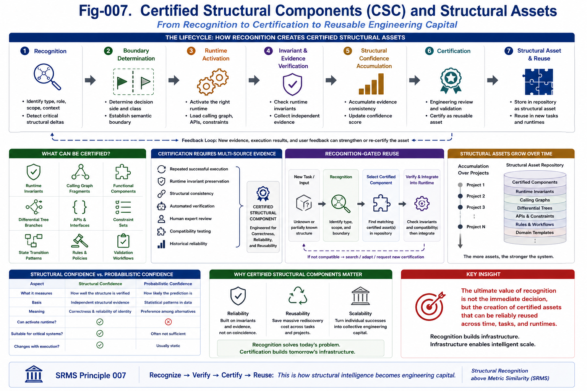

# SRMS-007 — Certified Structural Components

## Structural Recognition above Metric Similarity (SRMS)

**Author:** Sizhe Tan and GPT-Obot

---

# Abstract

Structural recognition is not an end in itself.

Its long-term value lies in producing reusable engineering assets.

When a structure has been repeatedly recognized, verified, validated, and successfully reused, it becomes more than recognized knowledge.

It becomes a **Certified Structural Component**.

Certified Structural Components transform structural intelligence from temporary reasoning into permanent computational infrastructure.

Rather than rediscovering structures repeatedly, future AI systems should accumulate, certify, and reuse them.

Recognition therefore becomes a continuous process of structural asset creation.

---



---

# 1. Recognition Produces Assets

Recognition is often viewed as a transient computational activity.

The system recognizes an object, produces a decision, and then forgets the recognition process.

Engineering evolves differently.

Successful recognition should become reusable.

Instead of repeating the same structural discovery,

future AI systems should preserve it as a certified asset.

Recognition therefore creates infrastructure.

---

# 2. From Recognition to Certification

Structural recognition naturally progresses through several stages.

```text
Unknown Structure
    ↓
Recognized Structure
    ↓
Verified Structure
    ↓
Trusted Structure
    ↓
Certified Structural Component
```

Each stage reduces uncertainty.

Certification represents accumulated structural confidence that has become reusable.

---

# 3. What Can Become a Certified Structural Component?

Certification is not limited to software modules.

Many structural objects can become reusable assets.

Examples include:

* Runtime Invariants
* Calling Graph fragments
* Differential Tree branches
* Recognition rules
* Constraint sets
* API specifications
* State-transition patterns
* Safety procedures
* Decision templates
* Validation workflows

All of these describe stable structures rather than temporary observations.

---

# 4. Certification Requires More Than Similarity

Similarity alone cannot certify anything.

Certification requires evidence.

Typical evidence includes:

* repeated successful execution,
* Runtime Invariant preservation,
* structural consistency,
* engineering validation,
* human review,
* automated verification,
* historical reliability,
* compatibility testing.

Certification therefore depends on structural confidence rather than metric proximity.

---

# 5. Structural Components Are Runtime Building Blocks

Once certified,

a structural component becomes part of the runtime ecosystem.

Examples include:

```text
Certified Sorting Runtime
```

```text
Certified Authentication Runtime
```

```text
Certified Safety Module
```

```text
Certified Recovery Procedure
```

Each component encapsulates:

* structural knowledge,
* Runtime Invariants,
* interfaces,
* constraints,
* execution behavior,
* engineering confidence.

Recognition therefore enables reusable runtime construction.

---

# 6. Recognition Before Reuse

Before reuse,

the system should recognize whether a certified component is applicable.

The process becomes:

```text
Task
    ↓
Structural Recognition
    ↓
Certified Component Selection
    ↓
Compatibility Verification
    ↓
Runtime Integration
    ↓
Execution
```

Recognition determines eligibility.

Certification guarantees reliability.

---

# 7. Structural Components Form Structural Assets

A certified component is one instance of a broader concept.

Together they form **Certified Structural Assets**.

Structural assets include:

* certified components,
* Runtime Invariants,
* Differential Trees,
* Calling Graphs,
* structural constraints,
* verified APIs,
* decision boundaries,
* recognition templates.

These assets become long-term computational capital.

---

# 8. Structural Assets Grow Continuously

Future AI systems should accumulate structural assets over time.

Each successful project contributes:

* new recognition rules,
* new Runtime Invariants,
* new certified components,
* improved Calling Graphs,
* refined Differential Trees,
* stronger confidence.

Knowledge therefore evolves cumulatively rather than repeatedly.

---

# 9. Engineering Benefits

Certified Structural Components provide many advantages.

They improve:

* reliability,
* explainability,
* engineering reuse,
* runtime safety,
* maintenance,
* certification,
* debugging,
* collaboration.

Instead of repeatedly solving the same structural problem,

future AI systems retrieve trusted structural assets.

---

# 10. Relation to Runtime Invariant Architecture

This concept naturally connects to Runtime Invariant Architecture (RIA).

Recognition identifies the structure.

Runtime Invariants preserve the identity.

Certification validates long-term reliability.

Runtime Architecture packages these structures into reusable computational units.

SRMS therefore provides the recognition layer.

RIA provides the packaging layer.

---

# 11. Relation to Structural Confidence

Structural Confidence introduced in SRMS-006 provides the foundation for certification.

Confidence accumulates through:

* recognition,
* validation,
* execution,
* invariant preservation,
* repeated success.

Certification represents confidence that has become stable enough for engineering reuse.

---

# 12. Recognition Creates Computational Capital

Structural assets behave like engineering capital.

The more certified structures a system possesses,

the less effort future problems require.

Recognition therefore performs two functions:

First,

it solves today's problem.

Second,

it builds tomorrow's infrastructure.

This accumulation transforms individual successes into collective computational capability.

---

# 13. Toward Structural Asset Repositories

Future AI systems should maintain repositories of certified structural assets.

Such repositories may contain:

* certified Runtime Invariants,
* verified Calling Graphs,
* reusable Differential Trees,
* trusted APIs,
* certified reasoning modules,
* domain-specific recognition templates,
* engineering constraints.

Instead of retrieving only similar documents,

AI systems will increasingly retrieve certified structural assets.

---

# 14. Recognition Is Infrastructure Construction

Recognition therefore has a much broader role than perception.

Each successful recognition can permanently strengthen the computational ecosystem.

The lifecycle becomes:

```text
Recognition
    ↓
Verification
    ↓
Confidence
    ↓
Certification
    ↓
Structural Asset
    ↓
Runtime Reuse
```

Recognition gradually transforms knowledge into infrastructure.

---

# Key Takeaways

* Recognition should create reusable engineering assets.
* Certification depends on structural evidence rather than similarity.
* Certified Structural Components encapsulate Runtime Invariants, interfaces, constraints, and engineering confidence.
* Structural assets accumulate continuously through successful recognition and validation.
* Recognition solves immediate problems while simultaneously building future computational infrastructure.
* Certified Structural Assets become the long-term capital of structural intelligence.

---

# SRMS Principle 007

> **The ultimate value of structural recognition is not the immediate decision but the creation of certified structural assets that can be reliably reused across future tasks, runtimes, and engineering systems. Recognition builds infrastructure.**
