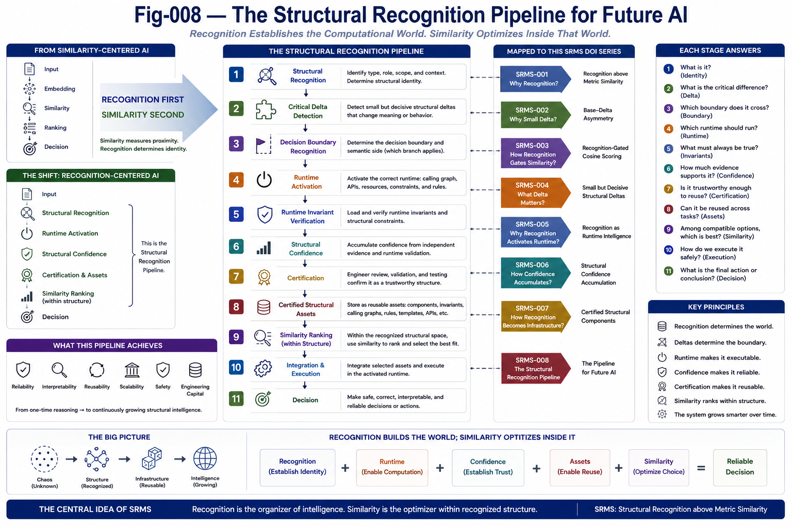
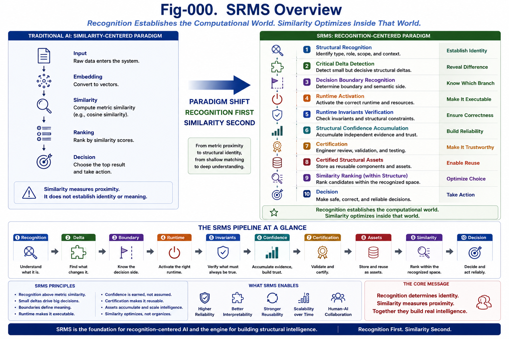

# SRMS-008 — The Structural Recognition Pipeline for Future AI

## Structural Recognition above Metric Similarity (SRMS)

**Author:** Sizhe Tan and GPT-Obot

---

# Abstract

The previous papers in this repository introduced the core concepts of Structural Recognition above Metric Similarity.

Recognition identifies structural identity.

Small structural deltas determine decision boundaries.

Recognition activates runtime.

Structural confidence accumulates through verification.

Certified structural components become reusable engineering assets.

Taken together, these ideas suggest a new computational architecture for future AI.

Rather than treating intelligence as a single scoring process, future AI should operate as a structural recognition pipeline in which each stage prepares the next.

Recognition becomes the organizing principle of intelligent computation.

---



---

# 1. From Similarity-Centered AI to Recognition-Centered AI

Many contemporary AI systems are organized around a relatively simple workflow.

```text id="o7pn2q"
Input
    ↓
Embedding
    ↓
Similarity
    ↓
Ranking
    ↓
Decision
```

This architecture has enabled remarkable advances.

However, it assumes that similarity alone is sufficient to organize computation.

The SRMS framework proposes a different computational order.

Recognition becomes the primary organizing mechanism.

Similarity becomes one specialized operation inside a larger structural process.

---

# 2. The Structural Recognition Pipeline

Future AI systems should organize computation as follows.

```text id="fjlwm4"
Input
    ↓
Structural Recognition
    ↓
Critical Delta Detection
    ↓
Decision Boundary Recognition
    ↓
Runtime Activation
    ↓
Runtime Invariant Verification
    ↓
Structural Confidence
    ↓
Certified Structural Assets
    ↓
Similarity Ranking
    ↓
Decision
```

Each stage reduces uncertainty while increasing structural understanding.

---

# 3. Recognition Determines Identity

The first responsibility of the pipeline is structural recognition.

Recognition determines:

* structural identity,
* structural type,
* functional role,
* semantic scope,
* applicable constraints,
* runtime context.

Without this stage,

subsequent similarity measurements lack structural meaning.

---

# 4. Critical Deltas Define the Boundary

Once the structure is recognized,

the system identifies decisive structural deltas.

These deltas determine:

* semantic transitions,
* safety boundaries,
* legal interpretations,
* runtime selection,
* execution behavior.

Similarity alone cannot reliably discover these boundaries.

Recognition explicitly identifies them.

---

# 5. Runtime Activation

Recognition activates the corresponding runtime.

Runtime activation selects:

* Calling Graphs,
* Runtime Invariants,
* APIs,
* certified components,
* execution rules,
* resource constraints.

Recognition therefore transforms a static description into an executable computational world.

---

# 6. Structural Confidence

Recognition is rarely perfect after one observation.

Confidence increases through:

* independent evidence,
* invariant verification,
* runtime execution,
* historical validation,
* engineering review.

Confidence should therefore evolve continuously throughout runtime.

---

# 7. Certified Structural Assets

Successful recognition should not disappear after one task.

Instead,

verified structures become reusable engineering assets.

These assets include:

* certified components,
* Runtime Invariants,
* Differential Trees,
* Calling Graphs,
* APIs,
* constraints,
* recognition templates,
* decision patterns.

Future AI systems should accumulate these assets continuously.

---

# 8. Similarity Returns to Its Proper Role

Metric similarity remains extremely valuable.

Its proper responsibility is:

* retrieval,
* ranking,
* recommendation,
* preference ordering,
* candidate selection within compatible structures.

Similarity therefore becomes a downstream optimization mechanism.

Recognition determines the comparison space.

Similarity determines the ordering inside that space.

---

# 9. Structural Recognition Is Progressive

The entire pipeline can be viewed as a progressive reduction of uncertainty.

```text id="gxw0ja"
Unknown
    ↓
Recognized
    ↓
Verified
    ↓
Trusted
    ↓
Certified
    ↓
Reusable
```

This progression transforms temporary observations into permanent engineering knowledge.

---

# 10. Recognition Builds Infrastructure

Each successful recognition contributes to future computation.

The accumulated infrastructure includes:

* structural assets,
* runtime libraries,
* certified modules,
* reusable workflows,
* engineering confidence.

Recognition therefore builds computational capital.

The value of the system increases with every verified structure.

---

# 11. Relation to Structural Intelligence

The SRMS pipeline naturally integrates with the broader Structural Intelligence framework.

Structural Recognition provides:

* identity discovery.

Differential Trees provide:

* structural organization.

Calling Graphs provide:

* functional relationships.

Runtime Invariants provide:

* structural persistence.

Structural Feasibility Confidence provides:

* engineering confidence.

Runtime Invariant Architecture provides:

* reusable packaging.

Together,

these components form a coherent computational ecosystem.

---

# 12. Implications for Future AI

Recognition-centered AI has important implications.

Future AI systems should increasingly support:

* explicit structural recognition,
* recognition-gated retrieval,
* Runtime Invariant selection,
* structural confidence management,
* certified asset repositories,
* reusable runtime components,
* interpretable engineering decisions.

This architecture moves AI beyond metric similarity toward structural computation.

---

# 13. The Recognition Pipeline as an Engineering Discipline

Structural recognition is not merely an algorithm.

It becomes an engineering discipline.

Future AI development will increasingly involve:

* recognizing structures,
* organizing structures,
* validating structures,
* certifying structures,
* reusing structures,
* evolving structural assets.

Recognition therefore becomes the foundation of long-term intelligent engineering.

---

# 14. A New Computational Hierarchy

The SRMS framework suggests the following hierarchy.

```text id="8oq0o2"
Recognition
        ↓
Delta
        ↓
Boundary
        ↓
Runtime
        ↓
Confidence
        ↓
Certification
        ↓
Structural Assets
        ↓
Similarity
        ↓
Decision
```

Each level depends on the previous one.

Similarity remains an essential computational tool.

It is no longer responsible for determining structural identity.

---

# 15. Conclusion

Modern AI has demonstrated the remarkable power of metric similarity.

The next stage of AI development will require an equally strong capability for structural recognition.

Recognition determines identity.

Critical deltas determine boundaries.

Runtime activates computation.

Confidence establishes trust.

Certification produces reusable assets.

Similarity ranks alternatives inside recognized structures.

Together,

these mechanisms form a recognition-centered computational architecture suitable for future intelligent systems.

---



---

# Key Takeaways

* Recognition organizes computation before similarity.
* Critical structural deltas determine decision boundaries.
* Runtime activation transforms recognition into execution.
* Structural confidence accumulates through independent evidence.
* Certified structural assets become reusable computational infrastructure.
* Similarity ranks candidates within recognized structural spaces.
* Future AI should evolve from similarity-centered architectures toward recognition-centered architectures.

---

# SRMS Principle 008

> **Future AI should be organized as a Structural Recognition Pipeline in which recognition establishes identity, runtime, confidence, and reusable structural assets before similarity performs ranking and optimization. Recognition is the organizing principle of intelligent computation.**
